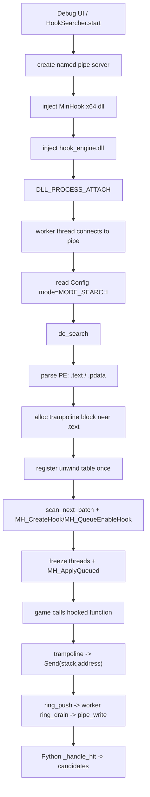
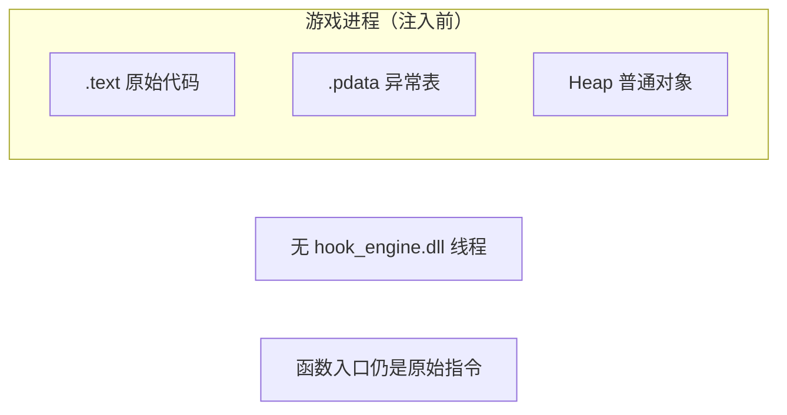
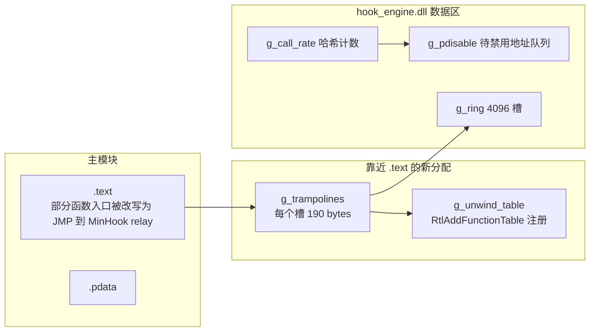
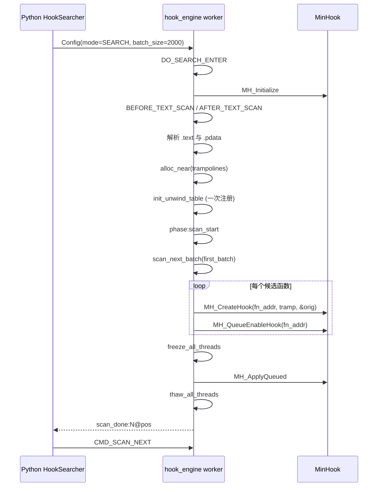
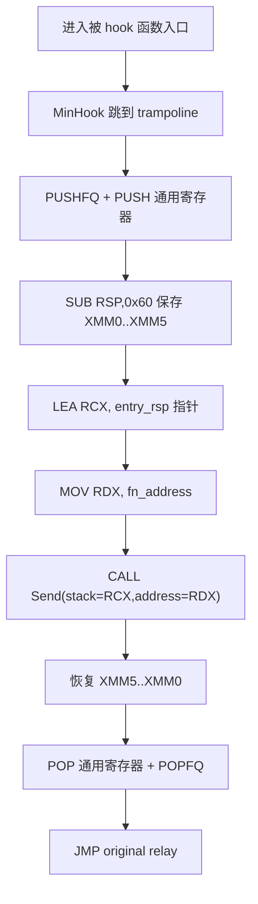
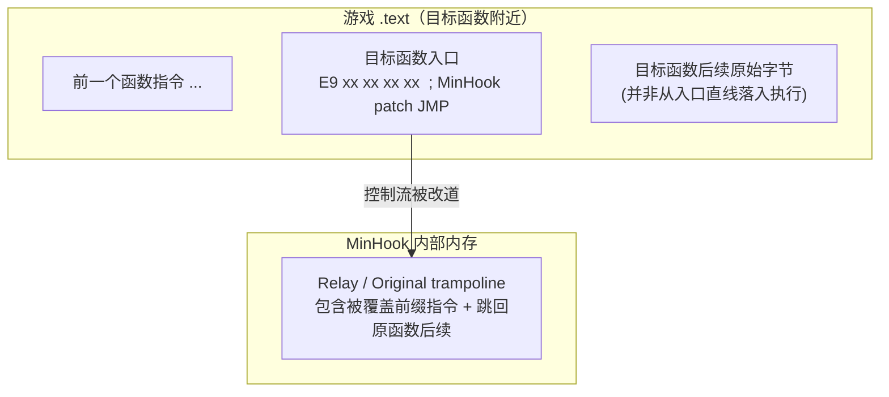
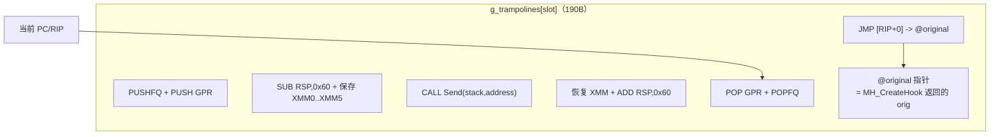
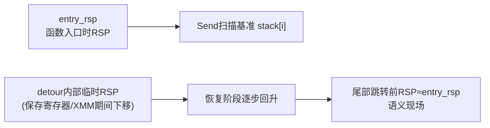
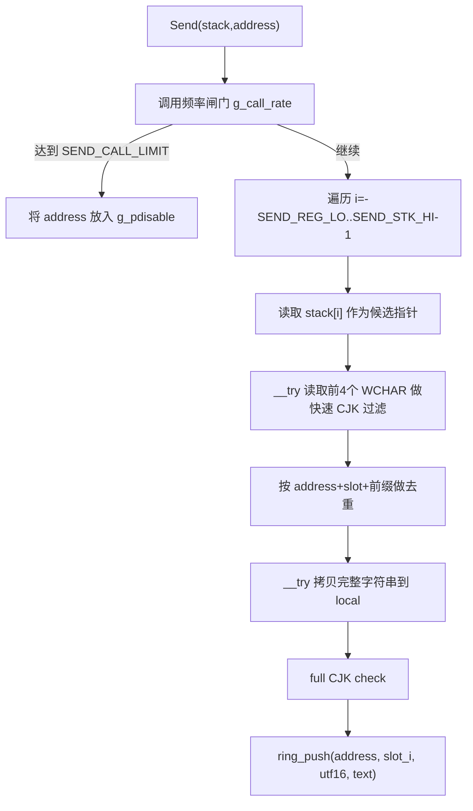
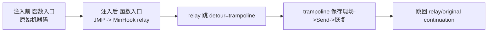

# JustReadIt Trampoline / Hook 注入机制详解（含内存状态与 Mermaid 图）

本文是给“懂一点栈和寄存器，但久未接触底层细节”的读者准备的。

目标：

1. 看懂本项目 `hook_engine.dll` 在 **注入前 / 注入后** 的内存变化。
2. 看懂 trampoline 的字节模板在运行时做了什么。
3. 看懂 `Send(stack, address)` 里 `stack[i]` 的来源，尤其为什么会出现 `-16..8` 的扫描窗口。
4. 建立排查“接力 hook”问题的分析框架。

[TOC]

---

## 0. 先给结论（速览）

- 当前搜索模式会“批量 hook `.pdata` 里的函数入口”，每个入口都跳到我们自己的 trampoline。
- trampoline 会保存现场（通用寄存器 + XMM0..XMM5 + flags），调用 `Send()` 扫描栈附近指针，再恢复现场，跳回 MinHook relay。
- `Send()` 不是直接读取“函数参数对象”，而是读取一个“以函数入口 RSP 为基准的窗口”。
- 扫描窗口较宽时（当前 C 侧仍是 `-16..8`），容易捕到调用链上其他层的文本指针，形成“接力候选”。
- Python 侧已经把 `slot_i` 限制到更像 ABI 参数位（过滤 shadow space），但 C 侧宽扫仍会制造噪声源。

---

## 1. 总体流程图（从 UI 到游戏进程）

---

## 2. 注入前 / 注入后的内存状态

> 这里说“注入后”是指 `MODE_SEARCH` 启动并开始装钩后的状态。

## 2.1 注入前（游戏原始状态）

关键点：

- 函数入口字节未改写。
- `.pdata` 仅描述游戏自身函数的 unwind 信息。
- 不存在 trampoline 内存块，不存在我们的 ring buffer 数据流。

## 2.2 注入后（搜索模式进行中）

关键点：

- 入口 patch 是 MinHook 完成；我们的 trampoline 是 detour 目标。
- `g_unwind_table` 对整个 trampoline block 只注册一次，避免 delete/add race。
- `Send()` 只做“尽量安全的内存探测 + 推环形队列”，避免在游戏线程里调用复杂 API。

---

## 3. do_search 阶段细分（与你日志字段一一对应）

你日志常见字段（例如 `DO_SEARCH_ENTER`, `text_seg:...`, `scan_done:2000@...`）对应如下：

日志理解技巧：

- `phase:scan_done count=2000`：第一批后累计已装钩数。
- `scan_done:2000@4000`：本批新增 2000，`.pdata` 游标到 4000。
- `scan_done:0@48466`：扫描穷尽。
- `mh_fail:0x... st=8`：MinHook 对该函数返回失败状态（常见是不支持/过短等）。

---

## 4. trampoline 逐步执行图（核心）

当前模板大小 `TRAMPOLINE_SIZE=190`，核心执行序列：

设计意图：

- 尽量“现场透明”：恢复后语义应与未 hook 基本一致。
- `Send()` 只拿到两个参数：
  - `stack`：函数入口时的 RSP 基准
  - `address`：当前 hook 的函数地址

### 4.1 detour 结尾时刻：原函数内存 + detour 内存快照

> 场景：PC 已经跑到我们 trampoline 的尾部（准备恢复现场并跳回原逻辑）。

#### 图 A：此刻游戏原始函数所在 `.text` 的状态（被 patch 后）

解释：

- 入口那几条原始指令已经不在入口原地顺序执行。
- 被覆盖前缀指令在 MinHook 的 original trampoline 里执行，然后跳回“原函数未覆盖后续地址”。

#### 图 B：此刻我们 detour（`g_trampolines` 槽）内部状态

解释：

- 你提到的“准备恢复栈结构”就是在 `S3/S4` 这段。
- 到 `S5` 时，`RSP` 和寄存器应已恢复为“进入 detour 前”的状态。
- `@original` 不是原函数入口，而是 MinHook 提供的 original trampoline 地址。

#### 图 C：同一时刻的栈指针关系（简化）

备注：

- `Send` 使用的是 `entry_rsp` 语义基准，不是恢复阶段某一瞬间的临时 `RSP`。
- 所以 `stack[i]` 的意义在整个 detour 生命周期中是稳定的（按入口时刻解释）。

---

## 5. `stack[i]` 到底指哪（重点解决你现在的困惑）

`Send(char **stack, uintptr_t address)` 里的 `stack` 不是 C 语言函数自己的局部数组，而是：

- trampoline 在调用 `Send` 前，通过 `LEA RCX, [RSP+0xE8]` 计算出的“**函数入口 RSP**”。
- 所以 `stack[i] == *(entry_rsp + i*8)`。

### 5.1 槽位语义（按当前模板）

- `stack[0]`：返回地址。
- `stack[-4]`：原 `RCX`（arg0）8 bytes
- `stack[-5]`：原 `RDX`（arg1）
- `stack[-10]`：原 `R8`（arg2）
- `stack[-11]`：原 `R9`（arg3）
- `stack[1..4]`：Win64 shadow space（不是第 1~4 个参数）32 bytes
- `stack[5..]`：真正栈上传参（arg5 起）

### 5.2 为什么历史上用了 `-16..8`

这是“宽搜窗口”：

- 负侧多扫寄存器快照附近，正侧扫到部分 caller frame。
- 优点：更容易“抓到点什么”。
- 代价：容易把调用链其他层的文本指针也抓进来，造成同一句文本在多个 hook 上接力。

这正是你当前观测到的现象来源之一。

---

## 6. `Send()` 内部状态机（每次函数命中时）

注意两个关键副作用：

1. **自动禁用热点地址**：达到阈值后，worker 线程会真正 `MH_QueueDisableHook/MH_ApplyQueued`。
2. **接力放大**：热点被禁后，下一层函数地址成为新来源，看起来像“hook 在轮换”。

---

## 7. Python 侧如何变成候选列表

来自 pipe 的每条命中是：`(hook_va, slot_i, encoding, text)`。

Python `_handle_hit()` 流程：

1. x`score_candidate(text, ocr_lang)` 做文本内容质量分。
2. 将 `slot_i` 映射到 `access_pattern`：
   - `-4/-5/-10/-11` → `r0/r1/r2/r3`
   - 栈位只保留 `slot_i=5..12`（过滤 `1..4` shadow space）
3. `hook_va -> (module, rva)`。
4. 用 `key = f"{rva:#x}:{pattern}"` 聚合，累计 `hit_count`。

这意味着：

- 不同 `rva` 不会合并，即使文本一样。
- 所以“多地址同文本”会在 UI 里表现为多个候选并存或接力出现。

---

## 8. 注入前/后“函数入口字节”直观对比

你的崩溃日志里 `fn_entry16` 出现 `E9 ...`，正是入口被 MinHook 改写的证据。

---

## 9. 为什么“只 hook .text”没明显改变

在这个目标程序上：

- `.pdata` 记录的函数基本都位于 `.text`。
- 所以 `fn_addr in .text` 过滤几乎不裁剪集合（`skip_nontext` 常为 0）。

也就是说，瓶颈不在“段过滤”，而在“来源稳定性建模 + 扫描窗口 + 热点禁用策略”。

---

## 10. 建议你接下来重点观察的三组数据

如果你要自己进一步分析，建议先做这三组观测（最省力）：

1. **自动禁用轨迹**
   - 记录哪些 `address` 触发 `SEND_CALL_LIMIT` 被禁。
   - 看接力是否总发生在“前一个地址刚被禁”之后。

2. **slot 分布**
   - 统计候选里 `r0/r1/r2/r3` 与 `s+...` 的比例。
   - 若 `s+...` 占比高，说明仍有较强栈噪声来源。

3. **同文本跨地址漂移图**
   - 对同一文本前缀，画时间线：`t -> (rva, pattern)`。
   - 若呈阶梯式迁移，基本可确认“热点禁用导致接力”。

---

## 11. 你可以把这份文档怎么读（建议顺序）

如果你现在“理解断层”主要在栈和 trampoline：

1. 先看第 4 节（trampoline 执行图）
2. 再看第 5 节（`stack[i]` 语义）
3. 再看第 6 节（Send 状态机）
4. 最后看第 7 节（Python 候选聚合）

读完这四节，你就能直接定位：问题是发生在“C 侧采样”还是“Python 侧聚合”。

---

## 12. 附：和当前源码对应的关键点（便于对照）

- `Send` 扫描循环：`for (int i=-(int)SEND_REG_LO; i<(int)SEND_STK_HI; i++)`
- 调用频率闸门：`CALL_RATE_SIZE`, `SEND_CALL_LIMIT`, `g_pdisable`, `g_need_apply`
- batch 扫描：`scan_next_batch()` + `CMD_SCAN_NEXT`
- Python 命中处理：`HookSearcher._handle_hit()`

---

如果你愿意，我可以在下一步再补一版“带具体地址的示例推演”（用一个假想函数调用现场，把 `stack[-11]`、`stack[5]` 分别代入），会更像你在调试器里单步看到的样子。